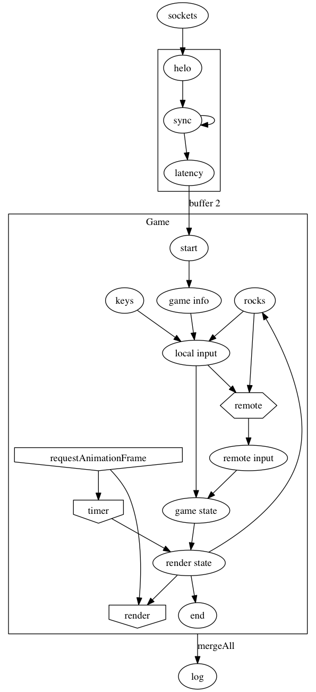

#Rx Spacewar

**Rx Spacewar** is a two player network arcade game in the category of low friction games like the original [Spacewar!](http://en.wikipedia.org/wiki/Spacewar_(video_game\)), [Asteroids](http://en.wikipedia.org/wiki/Asteroids_(video_game\)), and [Maelstrom](http://en.wikipedia.org/wiki/Maelstrom_(1992_video_game\)).

Its implementation is an experiment in applying the principles of reactive programming to make a fault tolerant distributed system that is eventually consistent.

<!--

The process of developing this little game made me realize how alien the reactive paradigm feels at first. When I started, I collected all the input in a reactive stream, dumped that in a global variable and then wrote a conventional imperative arcade game that peeked at that input in a conventional game loop. But one thing I really liked about Rx was I was able to do that and get something working and then slowly figure out how to adapt to the Reactive paradigm.

One thing I noticed was the way this upended my intutions about modularity. For example, when I originally wrote this, I had the files divided into the semantic things in the game, like ships, and shots and players. Over time, I refactored this along functional lines: ticking the simulation, or drawing. It was tickles me that functional programming is, well, more functional.

But what Ben XXX said when he came here was that it takes about 6 weeks to become comfortable and looking at my git log, that's exactly where I am. Over time, I was able to adapt my imperative code better to the reactive paradigm.

One of the last steps of this was untangling the dependency between the stream of input from the users vs the stream of update requests from 

###Observable of observables
e.g. sockets, server logging,  gameInfo?
###Immutability and share()
###Observable transport

-->
Rx Spacewar uses a "replay" strategy to achieve consistency across clients. When out-of-order input is received, that input is sorted into its proper place in the time-ordered list of input, and state is reset to the state before the disordered input. The subsequent input is then replayed, resulting in a recomputed game state.

The server is a simple Rx pipeline that combines two socket connections, sends a "START" message to each, and then forwards messages received on one socket to the other one. It also contains a little bit of smarts to make it possible to loopback input and play a game with single socket.

The game goes through the following phases on the client:

1. Initialization
2. Synchronization
3. Gameplay

Initialization begins when the document is ready and sets up the reactive pipeline. Synchronization is initiated by the server and uses the [Berkeley algorithm](http://en.wikipedia.org/wiki/Berkeley_algorithm) with one of the clients acting as the master. Synchronization results in a relative time for each client after which the game starts. From then, input is reported to the other client in time relative to the game start. The game currently doesn't handle cases of clock skew.

Conceptually, the game has three threads. The *Input* thread combines local input from the keyboard, the random generator of rocks, and the input from the other player via the socket. 

The *Game* thread runs on the timeout hook, but its execution is controlled by the *Render* thread. The *Render* thread runs inside <code>requestAnimationFrame</code> and schedules execution of the Game thread. In practice, the Game state is partially computed on the Input thread because I haven't quite wrapped my mind around Rx Schedulers yet.

Rendering is handled with the super-cool Canvas 2D API. 